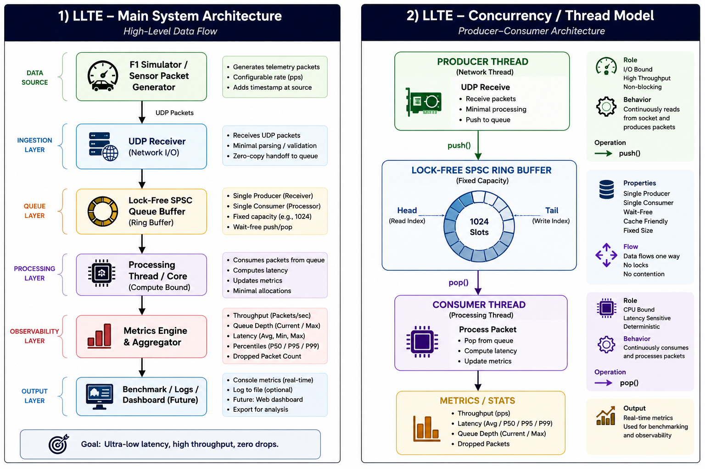

# LLTE: Low-Latency Telemetry Engine


## High-throughput C++20 telemetry ingestion pipeline with lock-free concurrency, achieving 119K packets/sec and ~10× lower average latency.


## Performance Benchmark Results

| Metric | Before Optimization (0ms Saturation Load) | After Sprint 7 Optimization |
|--------|-------------------------------------------|-----------------------------|
| Throughput | ~48K packets/sec | ~119K packets/sec |
| Avg Latency | ~423 µs | ~40 µs |
| Min Latency | — | ~4 µs |
| P50 Latency | ~21 µs | ~16 µs |
| P95 Latency | ~2500 µs | ~36 µs |
| P99 Latency | ~3600 µs | ~57 µs |
| Max Queue Depth | 668 / 1024 | 405 / 1024 |
| Dropped Packets | 0 | 0 |
| Improvement | — | **2.4× throughput / ~10× avg latency reduction** |

## Benchmark Results & Analysis



- [Benchmark Summary](./benchmarks/benchmark_summary.md)

### Optimization Changes
- Preallocated latency buffer
- Bounded rolling latency window
- Reduced allocation churn
- Cache-line aligned atomics
- Lower hot-path jitter

### Performance Gains
- **2.4× throughput improvement**
- **~10× lower average latency**
- **Massive tail-latency reduction (P99: ms → µs)**
- Improved queue stability under saturation
---

##  Key Features

- UDP-based telemetry ingestion
- Lock-free **SPSC ring-buffer queue**
- Multi-threaded producer-consumer pipeline
- End-to-end packet latency tracking
- Tail latency observability (**P50 / P95 / P99**)
- Throughput benchmarking
- Queue depth monitoring
- Packet-drop detection
- Bounded memory optimization
- Cache-line aligned atomics (`alignas(64)`)
- Stress-mode benchmarking (`0ms / 1ms producer delay`)

## 🏗️ System Architecture

LLTE is explicitly designed to separate the **fast path** (network I/O) from the **compute path** (analytics), bridged by lock-free data structures to prevent mutex contention and ensure deterministic latency (p99).

```text
┌────────────────┐       UDP       ┌─────────────────┐
│  Simulator     │ ──────────────▶ │ Receiver Thread │
│ (Packet Gen)   │                 │  (I/O Bound)    │
└────────────────┘                 └────────┬────────┘
                                            │
                                            ▼
                                 ┌─────────────────┐
                                 │ Lock-Free Queue │
                                 │   SPSC Buffer   │
                                 └────────┬────────┘
                                          │
                                          ▼
                                 ┌─────────────────┐
                                 │ Processing Core │
                                 │  (CPU Bound)    │
                                 └────────┬────────┘
                                          │
                                          ▼
                                 ┌─────────────────┐
                                 │ Metrics Engine  │
                                 │ P50 / P95 / P99 │
                                 │ Queue Depth     │
                                 │ Throughput      │
                                 └─────────────────┘
```

---

### Rust Port for Systems Comparison

Planned hot-path rewrite in Rust:

- Queue implementation
- Processing engine
- Memory safety benchmarking
- Throughput comparison
- Tail-latency comparison
- Allocation behavior study
- Threading model comparison

Goal: **C++ vs Rust low-latency systems performance study**

##  Run Benchmarks

```bash
mkdir build && cd build
cmake ..
make -j

# terminal 1
./llte_receiver

# terminal 2
./llte_simulator
```

## 👨‍💻 Author

MARKA SAI CHARAN

Systems Engineering • High Performance Computing • C++

---

## 📄 License

MIT License